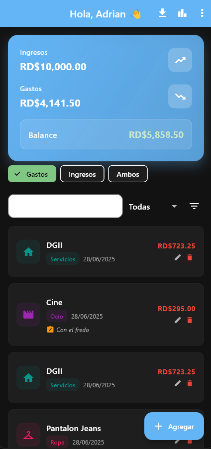
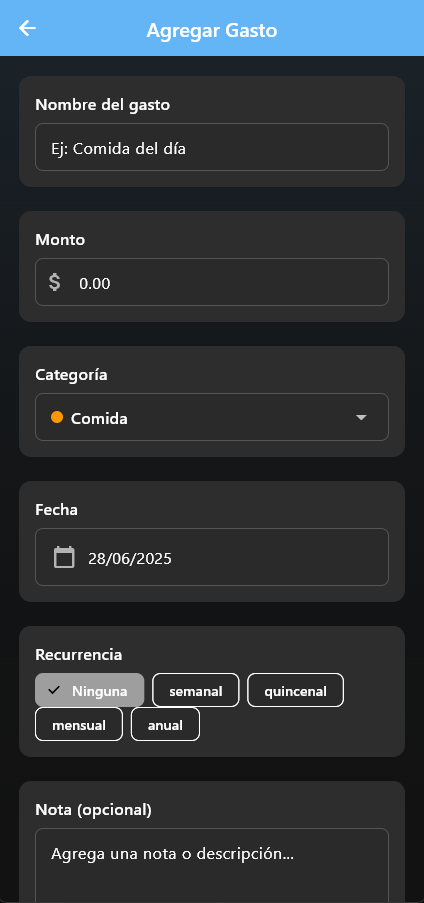
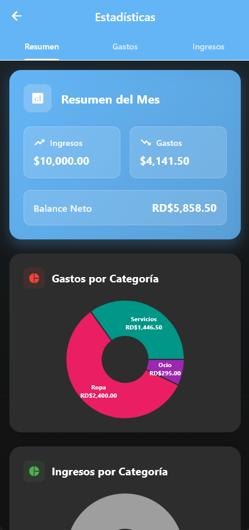
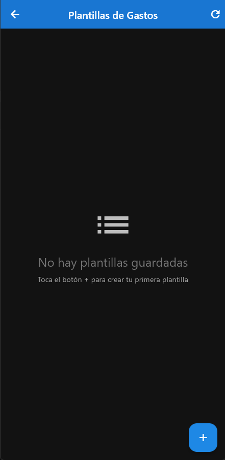
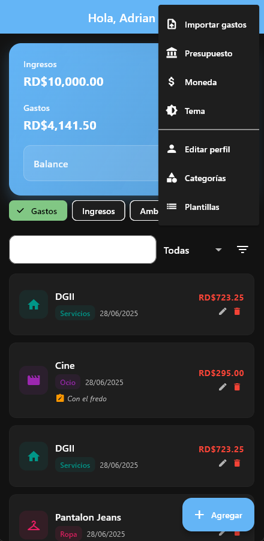

# 📱 Gestor de Gastos - Aplicación Flutter

Una aplicación móvil completa para la gestión personal de gastos e ingresos, desarrollada con Flutter y Dart.

## 🚀 Características Principales

### 💰 Gestión Financiera

- **Gastos e Ingresos**: Registro completo con categorías personalizables
- **Balance en Tiempo Real**: Visualización de ingresos, gastos y balance mensual
- **Presupuesto Mensual**: Configuración y seguimiento de presupuestos
- **Múltiples Monedas**: Soporte para DOP, MXN, USD, EUR, COP, ARS

### 📊 Análisis y Estadísticas

- **Gráficos Interactivos**: Gráficos de pastel y barras para visualizar gastos
- **Estadísticas Detalladas**: Análisis por categoría, período y tipo
- **Reportes Mensuales**: Resúmenes completos de actividad financiera

### 🔄 Funcionalidades Avanzadas

- **Gastos Recurrentes**: Configuración de gastos semanales, quincenales, mensuales y anuales
- **Plantillas de Gastos**: Creación y uso de plantillas favoritas
- **Importación/Exportación CSV**: Backup y restauración de datos
- **Búsqueda y Filtros**: Búsqueda avanzada por texto, categoría, fecha y monto

### 🎨 Interfaz de Usuario

- **Diseño Moderno**: UI/UX intuitiva y atractiva
- **Modo Oscuro/Claro**: Soporte completo para ambos temas
- **Responsive**: Optimizada para móviles y tablets
- **Accesibilidad**: Diseño inclusivo y fácil de usar

## 🛠️ Tecnologías Utilizadas

- **Flutter 3.32.5**: Framework de desarrollo multiplataforma
- **Dart**: Lenguaje de programación
- **SQLite**: Base de datos local con sqflite
- **SharedPreferences**: Almacenamiento de configuraciones
- **Charts**: Visualización de datos con fl_chart
- **CSV**: Importación/exportación de datos

## 📱 Plataformas Soportadas

- ✅ Android
- ✅ iOS
- ✅ Web
- ✅ Windows
- ✅ macOS
- ✅ Linux

## 🚀 Instalación y Configuración

### Prerrequisitos

- Flutter SDK 3.32.5 o superior
- Dart SDK
- Android Studio / VS Code
- Git

### Pasos de Instalación

1. **Clonar el repositorio**

   ```bash
   git clone [URL_DEL_REPOSITORIO]
   cd gestor_gastos
   ```

2. **Instalar dependencias**

   ```bash
   flutter pub get
   ```

3. **Ejecutar la aplicación**
   ```bash
   flutter run
   ```

### Configuración para Desarrollo

1. **Verificar Flutter**

   ```bash
   flutter doctor
   ```

2. **Analizar código**

   ```bash
   flutter analyze
   ```

3. **Ejecutar tests**
   ```bash
   flutter test
   ```

## 📁 Estructura del Proyecto

```
lib/
├── main.dart                 # Punto de entrada de la aplicación
├── db/
│   └── database_helper.dart  # Gestión de base de datos SQLite
├── models/
│   ├── expense.dart          # Modelo de gastos
│   ├── income.dart           # Modelo de ingresos
│   └── expense_template.dart # Modelo de plantillas
├── screens/
│   ├── home_page.dart        # Pantalla principal
│   ├── add_expense_page.dart # Agregar gastos
│   ├── add_income_page.dart  # Agregar ingresos
│   ├── stats_page.dart       # Estadísticas
│   ├── templates_page.dart   # Gestión de plantillas
│   └── ...                   # Otras pantallas
└── utils/
    ├── app_colors.dart       # Paleta de colores
    └── web_csv_download.dart # Funcionalidades web
```

## 🎯 Funcionalidades Detalladas

### Gestión de Gastos

- ✅ Agregar, editar y eliminar gastos
- ✅ Categorización automática
- ✅ Notas y descripciones
- ✅ Fechas personalizables
- ✅ Gastos recurrentes

### Gestión de Ingresos

- ✅ Registro de ingresos
- ✅ Categorización
- ✅ Seguimiento de balance

### Análisis Financiero

- ✅ Gráficos de gastos por categoría
- ✅ Estadísticas mensuales
- ✅ Comparativas de períodos
- ✅ Alertas de presupuesto

### Personalización

- ✅ Temas claro/oscuro
- ✅ Categorías personalizables
- ✅ Monedas múltiples
- ✅ Nombre de usuario

## 📊 Capturas de Pantalla


_Pantalla principal con balance y estadísticas_


_Formulario para agregar nuevos gastos_


_Gráficos y análisis financiero_


_Gestión de plantillas de gastos_


_Configuración de temas y preferencias_

## 🤝 Contribución

1. Fork el proyecto
2. Crea una rama para tu feature (`git checkout -b feature/AmazingFeature`)
3. Commit tus cambios (`git commit -m 'Add some AmazingFeature'`)
4. Push a la rama (`git push origin feature/AmazingFeature`)
5. Abre un Pull Request

---

**Versión**: 1.0.0  
**Última actualización**: Junio 2025
